# Diagrama de Entidad-Relación - StudentsPoint

## Mermaid Diagram

```mermaid
erDiagram
    %% TABLA PRINCIPAL DE USUARIOS
    User {
        int id PK
        string email UK "Identificador único"
        string name "Nombre completo"
        string career "Carrera del estudiante"
        string role "student|moderator|director_carrera|admin_global"
        int semestre "Semestre actual"
        string telefono "Teléfono opcional"
        string linkedin_url "Perfil LinkedIn"
        string github_url "Perfil GitHub"
        string picture_file "Foto de perfil"
        boolean es_estudiante_gmail "Flag para Gmail"
        datetime created_at
    }

    %% SEDES Y CAMPUS
    Sede {
        int id PK
        string slug UK "Identificador único"
        string nombre "Nombre de la sede"
        string direccion "Dirección física"
        float lat "Latitud GPS"
        float lng "Longitud GPS"
    }

    %% FOROS POR CARRERA
    Foro {
        int id PK
        string slug UK "Identificador único"
        string carrera "Carrera específica"
        string titulo "Título del foro"
        boolean es_privado "Solo estudiantes de la carrera"
        text descripcion "Descripción del foro"
        datetime created_at
    }

    %% POSTS DEL FORO
    Post {
        int id PK
        string titulo "Título del post"
        text contenido "Contenido del post"
        string tipo "comentario|encuesta|anuncio"
        string estado "publicado|revision|oculto"
        int votos_positivos "Likes"
        int votos_negativos "Dislikes"
        datetime created_at
        datetime updated_at
    }

    %% ENCUESTAS
    Poll {
        int id PK
        string titulo "Título de la encuesta"
        text descripcion "Descripción"
        boolean multi "Múltiples opciones"
        boolean anonima "Votos anónimos"
        string estado "borrador|activa|cerrada|archivada"
        json carreras "Carreras filtradas"
        datetime created_at
    }

    %% MERCADO DE PRODUCTOS
    Producto {
        int id PK
        string titulo "Título del producto"
        text descripcion "Descripción"
        string estado "borrador|publicado|vendido|oculto"
        decimal precio "Precio en CLP"
        string url_principal "Enlace principal"
        string tipo_enlace "facebook|yapo|mercadolibre|otro"
        json urls_adicionales "URLs adicionales"
        datetime created_at
    }

    %% PORTFOLIO - LOGROS
    Logro {
        int id PK
        string titulo "Título del logro"
        text descripcion "Descripción"
        string tipo "certificacion|premio|reconocimiento"
        string estado "obtenido|en_proceso|pendiente"
        date fecha_obtencion "Fecha de obtención"
        boolean visible "Visible en CV"
        datetime created_at
    }

    %% PORTFOLIO - PROYECTOS
    Proyecto {
        int id PK
        string titulo "Título del proyecto"
        text descripcion "Descripción"
        json tecnologias "Tecnologías utilizadas"
        string estado "en_desarrollo|completado|en_pausa|cancelado"
        date fecha_inicio "Fecha de inicio"
        date fecha_fin "Fecha de fin"
        string url_repositorio "URL del repo"
        string url_demo "URL de demo"
        json imagenes "URLs de imágenes"
        boolean visible "Visible en CV"
        datetime created_at
    }

    %% PORTFOLIO - EXPERIENCIAS
    ExperienciaLaboral {
        int id PK
        string empresa "Nombre de la empresa"
        string cargo "Cargo desempeñado"
        text descripcion "Descripción del trabajo"
        string tipo_contrato "practica|part_time|full_time|freelance|voluntariado"
        date fecha_inicio "Fecha de inicio"
        date fecha_fin "Fecha de fin"
        boolean actual "Trabajo actual"
        string ubicacion "Ubicación del trabajo"
        boolean visible "Visible en CV"
        datetime created_at
    }

    %% PORTFOLIO - HABILIDADES
    Habilidad {
        int id PK
        string nombre "Nombre de la habilidad"
        int nivel "Nivel 1-5"
        string categoria "tecnica|blanda|idioma|herramienta"
        boolean visible "Visible en CV"
        datetime created_at
    }

    %% NOTIFICACIONES
    Notificacion {
        uuid id PK
        string titulo "Título de la notificación"
        text mensaje "Mensaje"
        string tipo "info|success|warning|error|forum|market|portfolio"
        boolean leida "Leída por el usuario"
        json data_extra "Datos adicionales"
        string url_redirect "URL de redirección"
        string icono "Icono FontAwesome"
        string prioridad "baja|media|alta"
        boolean enviada_push "Enviada por push"
        datetime created_at
        datetime leida_at
    }

    %% RECORRIDOS VIRTUALES
    Recorrido {
        int id PK
        string titulo "Título del recorrido"
        datetime created_at
    }

    RecorridoPaso {
        int id PK
        int orden "Orden en el recorrido"
        string titulo "Título del paso"
        text descripcion "Descripción"
        string imagen_url "URL de la imagen"
        float lat "Latitud GPS"
        float lng "Longitud GPS"
        boolean usar_streetview "Usar Street View"
        float streetview_heading "Dirección de cámara"
        float streetview_pitch "Inclinación"
        float streetview_fov "Campo de visión"
        string imagen_360_url "URL imagen 360°"
        string imagen_360_thumbnail "Thumbnail 360°"
    }

    %% REPORTES DE INFRAESTRUCTURA
    Reporte {
        int id PK
        string categoria "Categoría del problema"
        text descripcion "Descripción del problema"
        float lat "Latitud GPS"
        float lng "Longitud GPS"
        string estado "abierto|revision|resuelto"
        int prioridad "Prioridad 0-10"
        datetime creado_at
    }

    %% CONVERSIÓN DE DOCUMENTOS
    ConversionJob {
        int id PK
        string tipo_conversion "word_to_pdf|pdf_to_word"
        string estado "pendiente|procesando|completado|error"
        string archivo_original "Archivo original"
        string archivo_convertido "Archivo convertido"
        boolean usar_ocr "Usar OCR"
        text error_mensaje "Mensaje de error"
        datetime created_at
        datetime completed_at
    }

    %% CONEXIONES PRINCIPALES
    User ||--o{ Sede : "pertenece_a"
    User ||--o{ Foro : "crea_foros"
    User ||--o{ Post : "crea_posts"
    User ||--o{ Poll : "crea_encuestas"
    User ||--o{ Producto : "vende_productos"
    User ||--o{ Logro : "tiene_logros"
    User ||--o{ Proyecto : "tiene_proyectos"
    User ||--o{ ExperienciaLaboral : "tiene_experiencias"
    User ||--o{ Habilidad : "tiene_habilidades"
    User ||--o{ Notificacion : "recibe_notificaciones"
    User ||--o{ Reporte : "crea_reportes"
    User ||--o{ ConversionJob : "realiza_conversiones"

    Sede ||--o{ Foro : "tiene_foros"
    Sede ||--o{ Recorrido : "tiene_recorridos"
    Sede ||--o{ Reporte : "recibe_reportes"

    Foro ||--o{ Post : "contiene_posts"

    Recorrido ||--o{ RecorridoPaso : "tiene_pasos"

    Reporte ||--o{ ReporteMedia : "tiene_archivos"
```

## Cómo usar este diagrama:

### 1. **Mermaid Live Editor** (Recomendado)
- Ve a: https://mermaid.live/
- Copia y pega el código del diagrama
- Puedes exportar como PNG, SVG o PDF

### 2. **GitHub/GitLab**
- Crea un archivo .md en tu repositorio
- GitHub y GitLab renderizan automáticamente los diagramas Mermaid

### 3. **VS Code**
- Instala la extensión "Mermaid Preview"
- Abre el archivo .md y usa Ctrl+Shift+P > "Mermaid Preview"

### 4. **Herramientas online**
- **Draw.io**: https://app.diagrams.net/
- **Lucidchart**: https://www.lucidchart.com/
- **Creately**: https://creately.com/

## Resumen de Tablas:

| **Módulo** | **Tablas** | **Propósito** |
|------------|------------|---------------|
| **👤 Usuarios** | `User` | Gestión de usuarios y autenticación |
| **🏢 Campus** | `Sede`, `Recorrido`, `RecorridoPaso` | Sedes y recorridos virtuales |
| **💬 Foro** | `Foro`, `Post` | Sistema de foros por carrera |
| **📊 Encuestas** | `Poll` | Sistema de encuestas |
| **🛒 Mercado** | `Producto`, `CategoriaProducto` | Mercado de productos |
| **📁 Portfolio** | `Logro`, `Proyecto`, `ExperienciaLaboral`, `Habilidad` | CV y portfolio |
| **🔔 Notificaciones** | `Notificacion`, `NotificacionTemplate`, `NotificacionConfig` | Sistema de notificaciones |
| **📋 Reportes** | `Reporte`, `ReporteMedia` | Reportes de infraestructura |
| **📄 Documentos** | `ConversionJob` | Conversión de documentos |
| **💚 Bienestar** | `BienestarItem` | Contenidos de bienestar |
| **🎓 OTEC** | `Curso` | Cursos abiertos |

## Relaciones Clave:
- **User** es la tabla central (1:N con casi todas las demás)
- **Sede** conecta con foros, recorridos y reportes
- **Foro** tiene posts (1:N)
- **Recorrido** tiene pasos (1:N)
- **Portfolio** tiene 4 tablas relacionadas (Logro, Proyecto, Experiencia, Habilidad)
